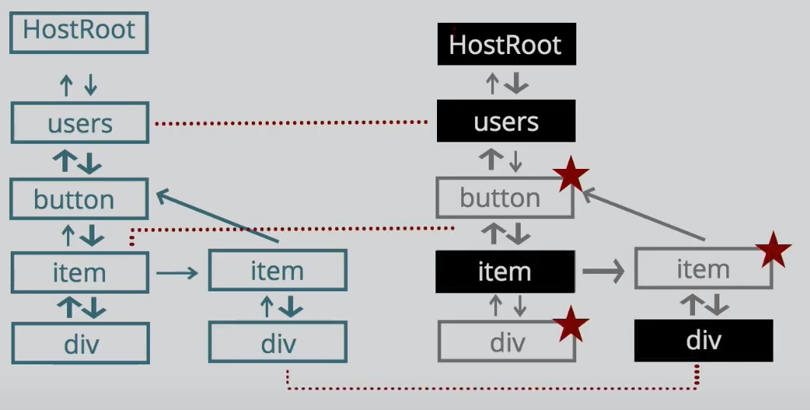
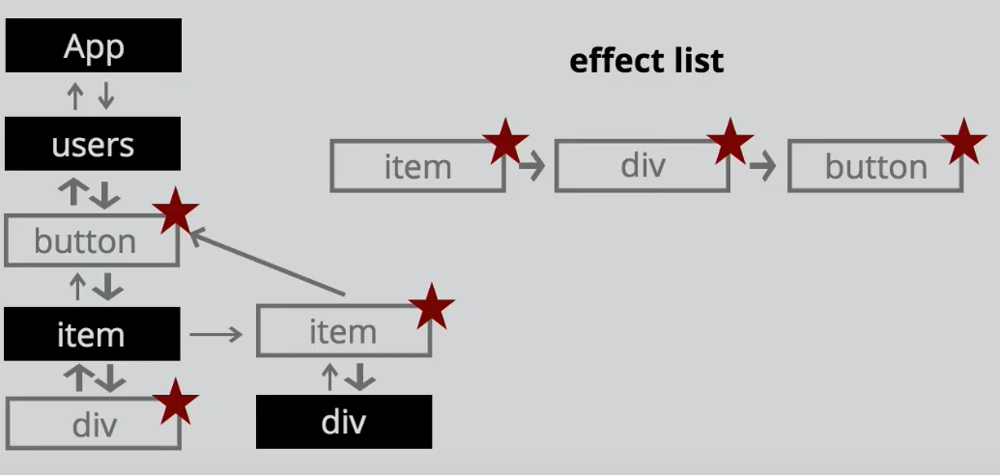

# React - Fiber
Resources
- [A Closer Look at React Fiber](https://www.alibabacloud.com/blog/a-closer-look-at-react-fiber_598138)
- [Notes from React Fiber team](https://github.com/acdlite/react-fiber-architecture)
- [React fiber resources](https://github.com/koba04/react-fiber-resources)
- [Good Video for Summarize React fiber](https://www.youtube.com/watch?v=0fUmOPQUv-Q)
## What is React Fiber?
Fiber is the new reconciliation engine or reimplementation of core algorithm in React v16. The goal of React Fiber is to increase its suitability for areas like animation, layout, gestures, ability to pause, abort, or reuse work and assign priority to different types of updates; and new concurrency primitives.

## What is Reconciler?
The reconciler is the part of React which contains the algorithm used to diff one tree with another to determine which parts need to be changed and send that to **Renderer**.
## What is Renderer?
This will update the UI. We can have different renderers having a shared reconciler. which means lot of code does not need to be repeated

## Problems Before React Fiber
Before React Fiber, Reconciliation and Renderer process is synchrnous,
and any updates needs to be gone through the Reconciliation process of Virtual DOM and make the Changes only updated the Real DOM

# With React Fiber
React Fiber is a rewrite of the React core, in order to allow for incremental rendering and to support a new reconciler featuring task scheduling, which was introduced in React 16. 
React separates reconciliation and rendering phases. 
Task Scheduler helps to Prioritze the work in call stack by swapping the unit of work that has been pushed into stack so that Heigher priority tasks will be run first by pausing lower priority tasks

==> Examples for Heigh Priority tasks:  Resizing the components

==> Examples for Low priority tasks: Number changing

## How  does the React pause and re use the work and run the next
This is based on Task Priorities built by React Fiber. 
For each tasks there is time limit to complete(may be 16 millseconds to 100 ms) and in between If any heigh priority task is added to tasks then it will pause the current(ongoing work) task and swap current task with heigher priority.
Now the Heigher Priority work will be executed and come back to the task which we have paused the task.
Then It starts comparing the existing task and clone all the elements which are not changed and flag the updated elements

- Pausing work is one of the features of Fiber based on the priorities
- React uses diffing algorithm to do the reconciliation process.
Before comarison

After comarison only below effected list will be updated to the DOM

